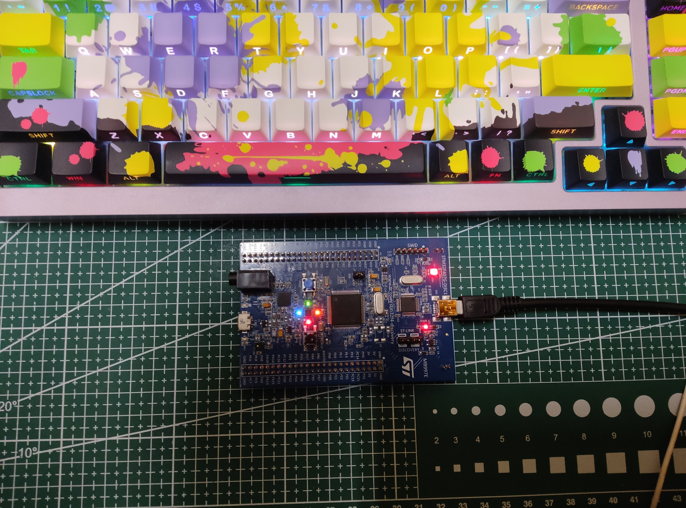

# STM32F4_ContextSwitch_LedDemo
## Project Overview
This project demonstrates a bare-metal task scheduling mechanism on the STM32F4 Discovery board, implemented from scratch without using any vendor libraries (HAL/LL).

It uses:
- SysTick for periodic time base
- PendSV for context switching
- Custom startup code and linker script
- The system controls 4 LEDs blinking at different time intervals, simulating a simple cooperative/preemptive scheduler.

## Features
- Bare-metal programming (no HAL, no CMSIS drivers except core headers if used)
- Custom startup file
- SysTick-based time slicing
- PendSV-based context switching
- Multiple tasks (LED blinking with different periods)
- Direct register-level programming

## System Architecture

## Learning Objectives
This project helps me understand:
- ARM Cortex-M exception model
- SysTick and PendSV usage
- Context switching mechanism
- Linker script and memory layout
- Bare-metal firmware development workflow

## Notes
- Hardware breakpoints are limited on Cortex-M cores
- Ensure correct clock configuration if extended
- Designed for educational purposes

## Demo

